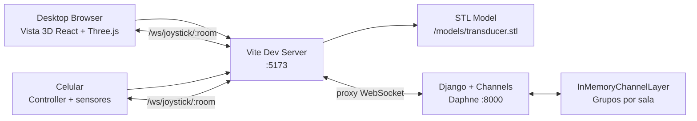
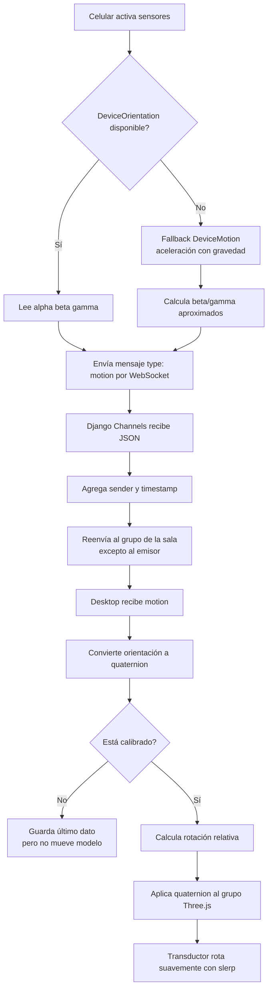
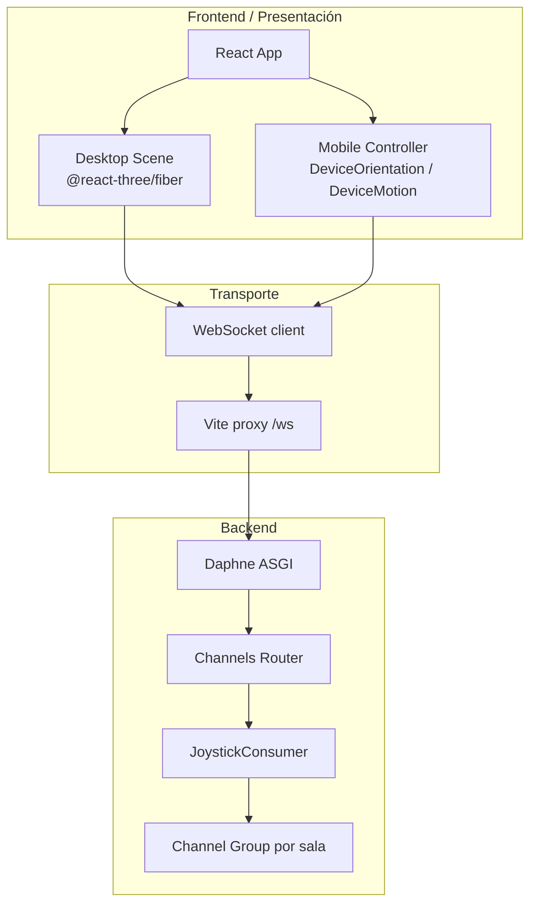

# Ultrasound Phone Joystick

Aplicacion Django + React para usar un celular como joystick/orientador de un transductor de ecografía en una escena 3D.

La pantalla principal crea una sala y muestra un QR. El celular entra a `/controller/<sala>`, pide permiso para usar sensores y envia datos por WebSocket al backend Django Channels. La vista 3D recibe esos datos y mueve/rota el transductor en Three.js.

## Estructura

- `backend/`: Django 3.2 + Channels.
- `frontend/`: React + Vite + Three.js.
- `frontend/public/models/transducer.stl`: ubicacion esperada para el STL principal.

La aplicación tiene dos vistas frontend:
- Vista desktop: muestra una escena Three.js con el transductor, genera una sala y muestra un QR.
- Vista móvil: se abre en /controller/<sala>, pide permisos de sensores y manda orientación del celular.
- El backend Django Channels funciona como relay WebSocket por sala: recibe mensajes de un cliente y los reenvía al resto de clientes conectados a esa misma sala. La lógica fuerte del movimiento vive en el frontend, especialmente en frontend/src/main.jsx.

## Arquitectura General


## Flujo de conexion

```mermaid
sequenceDiagram
  participant D as Desktop
  participant V as Vite
  participant B as Django Channels
  participant P as Phone

  D->>D: Crea sala aleatoria
  D->>D: Renderiza QR con /controller/<sala>
  D->>V: Abre app desktop
  D->>B: WebSocket /ws/joystick/<sala>/
  B->>B: group_add joystick_<sala>

  P->>V: Abre URL del QR
  P->>B: WebSocket /ws/joystick/<sala>/
  B->>B: group_add joystick_<sala>
  B-->>D: peer-joined
```


## Flujo de Movimiento


### Componentes Clave
- Backend ASGI: backend/ultrasound_joystick/asgi.py
- Routing WebSocket: backend/joystick/routing.py
- Consumer WebSocket: backend/joystick/consumers.py
- UI, sensores, Three.js y calibración: frontend/src/main.jsx
- Proxy Vite /api y /ws: frontend/vite.config.js
- Orquestación Docker: docker-compose.yml

### Consideraciones Relevantes
- El backend no persiste estado de salas ni mensajes. Usa InMemoryChannelLayer, así que sirve para desarrollo o una demo de una sola instancia, pero no escala horizontalmente ni sobrevive reinicios. Para producción o múltiples réplicas convendría Redis Channel Layer.
- La sala es un identificador aleatorio generado en frontend. No hay autenticación ni autorización; cualquiera con el código o URL de sala puede conectarse y enviar datos.
- El movimiento es relativo a una calibración inicial. Esto es una buena decisión: evita mapear directamente alpha/beta/gamma a ejes del modelo, que suele romperse por orientación de pantalla, postura inicial o navegador.
- La app no intenta calcular traslación física. Sólo rota el transductor. Con sensores web del celular no se puede reconstruir una posición estable en el espacio sin tracking adicional.
- Los sensores móviles pueden requerir HTTPS, sobre todo en iOS. El proyecto ya contempla esto con Cloudflare Tunnel en docker-compose.yml.
- El frontend usa Vite como punto de entrada y proxy. Esto simplifica LAN/túnel porque el celular sólo necesita abrir el frontend en :5173; Vite redirige /ws al backend.



## Ejecución
### Ejecutar backend

```bash
python3 -m venv .venv
source .venv/bin/activate
pip install -r requirements.txt
cd backend
python manage.py migrate
daphne -b 0.0.0.0 -p 8000 ultrasound_joystick.asgi:application
```

### Ejecutar frontend

```bash
cd frontend
npm install
npm run dev
```

Abrir la app en:

```text
http://localhost:5173
```

### Ejecutar con Docker

```bash
docker compose up --build
```

## Conectar desde el celular

1. Levanta backend y frontend escuchando en toda la red.

   Con Docker:

   ```bash
   docker compose up --build
   ```

   Sin Docker, el backend ya usa `-b 0.0.0.0` y Vite ya usa `--host 0.0.0.0` por la configuracion del proyecto.

2. Abre la pantalla principal desde la computadora usando la IP LAN, no `localhost`:

   ```text
   http://192.168.1.20:5173
   ```

4. Escanea el QR con el celular o abre manualmente:
   
5. En el celular toca `Activar sensores`.

Importante: si abres la pantalla principal en la computadora como `http://localhost:5173`, el QR tambien apuntara a `localhost`, y desde el celular eso no llega a tu computadora. Siempre usa la IP LAN para generar el QR.

Si el celular carga la pantalla pero no conecta el WebSocket, verifica que el firewall permita los puertos `5173` y `8000`.

6. Calibracion inicial (https://drive.google.com/file/d/1uaTOJ9MOxWtIrPJklcbxxLikdjKTohl3/view?usp=sharing)

La postura base es:
- Transductor: tal como carga la malla, boca arriba y con el boton a la derecha.
- Celular: Apoyado sobre la mesa en uso normal ("parado con la pantalla de frente"). Rotarlo 90 grados sobre el eje y para que la pantalla quede mirando hacia nuestra izquierda.

La escena conserva dos referencias:
- Aro negro central: el transductor no se traslada; rota alrededor de ese punto.
- Punto azul: rota la camara de la escena para que el punto azul quede frente a nosotros.

7. En la pantalla de la computadora presiona `Calibrar`.

Desde ese momento, la app resta esa orientacion inicial y mueve la malla de forma relativa al celular. Puedes presionar `Recalibrar` en cualquier momento para tomar una nueva referencia.

## Errores 

### Permisos con los sensores del celular

En Android Chrome, si el controlador muestra `Permiso: no events`, mira estos campos en la pantalla del celular:

- `Permiso`: deben decir `active` luego de hacer clic sobre `ativar sensores`. 
- `Accelerometer` y `Gyroscope`: debe decir `granted`. Si dicen `denied`, Chrome esta bloqueando permisos.

En iPhone/iOS, `DeviceOrientationEvent` normalmente requiere permiso explicito y casi siempre HTTPS. Si el boton "Activar sensores" no entrega datos, levanta Vite y Daphne detras de HTTPS local o usa un tunel seguro (*).

(*) Docker y Cloudflare Tunnel:

```bash
docker compose --profile tunnel up --build
```

Busca en los logs del servicio `tunnel` una URL parecida a:

```text
https://algo.trycloudflare.com
```


